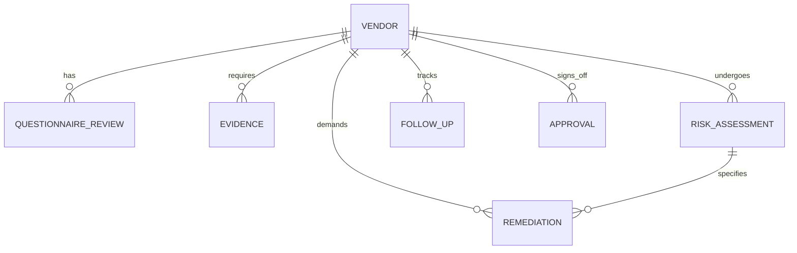

# MANDATE – Third-Party Security & Data Handling Review Tracker

MANDATE is a practical, enterprise-grade Third-Party Risk Management (TPRM) and Governance, Risk, and Compliance (GRC) platform. It is designed to emulate the exact workflows used by **Security Assessors, GRC Analysts, Privacy Analysts, and Cloud Security Compliance Engineers** at leading cloud-first organizations (including firms with stringent frameworks like Amazon/AWS).

This platform streamlines vendor security assessments, automates the identification of compliance/evidence gaps, tracks follow-up communications, records detailed inherent and residual risk assessments, and generates management-ready executive reports with multi-format export options.

---

## 🌟 Key Features & Core Capabilities

### 1. Vendor & System Inventory Management
- Centralized tracking of third-party vendors with metadata on **Data Types Processed**, **Criticality**, and **Deployment Models** (SaaS, Cloud-Hosted, On-Premises).
- Specific privacy risk attributes tracking (e.g., **PHI involved**, **Payment cardholder data**, **PII**, **Sensitive corporate data**).

### 2. Automated Questionnaire Analysis (`calculations.py`)
- **Semantic Heuristics**: Automatically flags responses containing high-risk phrases (e.g., *"no MFA"*, *"unencrypted"*, *"no backups"*, *"not encrypted"*) or vague answers (*"industry standard"*, *"best effort"*, *"upon request"*).
- Establishes follow-up request flags to keep assessors focused on vendors requiring remediation.

### 3. Smart Evidence Tracking & Gap Analysis
- Automatic calculations of **outdated** or **expired** security evidence (e.g., SOC 2 Type II reports, ISO 27001 certificates, Penetration test summaries, HIPAA BAAs, PCI DSS AOCs).
- **Context-Aware Gap Checks**: Automatically raises alerts if a vendor handles PHI or Payment Data but lacks the corresponding HIPAA, HITRUST, or PCI evidence.

### 4. Qualitative & Quantitative Risk Scoring
- High-fidelity **Risk Matrix (5x5)** to calculate Inherent and Residual Risk ratings based on Likelihood and Impact metrics.
- Documents risk drivers, compensating controls, and exception justifications.

### 5. Multi-Channel Follow-Up & Remediation Tracker
- Tracks open follow-up questions, vendor responses, and remediations.
- Automated warning flags for **overdue** items and **expired** risk acceptance exceptions.

### 6. Management-Ready Reporting & Exports
- **Executive Summary Dashboard**: High-fidelity KPI widgets showing risk levels, evidence gaps, and open follow-ups.
- **Interactive Visualizations**: Modern graphical insights for risk and review distribution using customized polar area and doughnut charts.
- **Enterprise Exports**: Clean exports to **multi-sheet Microsoft Excel Workbooks** (using `pandas` + `openpyxl`) and **Management Markdown Summaries**.

---

## 🛠️ Architecture & Database Design

MANDATE is built with **Flask (Python)** and a **SQLAlchemy-backed SQLite** database, structured around an industry-standard relational schema:



### Table Relationships & Database Models (`models.py`):
1. **`Vendor`**: Core entity containing metadata, business owner, data flags, and approval statuses.
2. **`QuestionnaireReview`**: Individual review points grouped by security domains (e.g., Access Management, Incident Response).
3. **`Evidence`**: Essential security documentation records with auto-expiration controls.
4. **`RiskAssessment`**: Quantitative 5x5 scoring history linking inherent risk to residual risk.
5. **`FollowUp`**: Actionable questionnaires queued for vendors with overdue tracking.
6. **`Remediation`**: Formal vendor condition tracker containing validation methods.
7. **`Approval`**: Exceptions register tracking CISO risk acceptances, justifications, and expiry dates.

---

## 🚀 Quick Start Guide

### 1. Prerequisites
Ensure you have Python 3.9+ installed on your system.

### 2. Installation
Clone the repository and install all dependencies:
```bash
pip install -r requirements.txt
```

### 3. Initialize & Seed Database
Reset the SQLite database and populate it with **15 realistic mock vendors, 75 domain-specific questionnaire reviews, 30 evidence records, 12 risk assessments, 20 follow-ups, 8 remediations, and 6 approvals**:
```bash
flask seed
```

### 4. Run the Development Server
Launch the Flask development server:
```bash
python app.py
```
Open [http://localhost:5000](http://localhost:5000) in your web browser to access the MANDATE platform.

---

## 📁 Project Directory Structure
```text
Mandate/
├── data/                    # Generated SQLite database directory
├── exports/                 # Excel and Markdown report exports
├── static/
│   ├── css/
│   │   └── styles.css       # Premium custom stylesheet with micro-animations
│   ├── js/
│   │   └── charts.js       # Interactive Chart.js setup for GRC dashboard metrics
│   └── templates/           # CSV templates for bulk imports
├── templates/               # Jinja2 HTML templates
│   ├── base.html            # Sidebar navigation and framework shell
│   ├── dashboard.html       # Visual dashboard with KPI widgets
│   ├── import.html          # Bulk CSV uploader with specifications
│   ├── reports.html         # Executive summary reports
│   └── ... (additional views)
├── app.py                   # Main Flask application entry point
├── calculations.py          # Threat analysis, GRC rules, and risk metrics
├── database.py              # SQLite context loader
├── exports.py               # Excel and Markdown generators
├── imports.py               # CSV uploader parser
├── models.py                # Database entity mappings
├── requirements.txt         # Package dependencies
└── seed_data.py             # Realistic, pre-populated GRC review records
```

---

## 🎓 Resume / Interview Talking Points
This project demonstrates the core technical skills and practical methodologies expected of a **Senior Security Assessor or Third-Party Risk Lead**:
* **Enterprise Risk Frameworks**: Designed a realistic 5x5 risk rating index based on Likelihood and Impact, translating raw vulnerability data into commercial GRC metrics.
* **Evidence Validation**: Implemented time-based expiration thresholds and gap analysis for critical GRC assets like ISO 27001 Certificates and SOC 2 Type II reports.
* **Automated Risk Triage**: Coded semantic keyword scanners in Python to identify incomplete, vague, or critical threat indicator responses from suppliers.
* **Regulatory Compliance**: Built database logic ensuring PHI (HIPAA) and Payment Data (PCI-DSS) suppliers are automatically flagged if they lack a signed BAA or current AOC.

---

## 🧭 GRC Assessor Methodology & Playbook

### 1. Vendor Risk Scoring Framework (5x5 Matrix)
MANDATE operates on an enterprise **5x5 Likelihood vs. Impact Risk Matrix** (yielding scores between 1 and 25):
* **Inherent Risk**: The raw risk level calculated before controls are audited. A vendor processing unmitigated clinical patient data is classified as *Critical Inherent Risk (Score 20–25)*.
* **Residual Risk**: The actual remaining risk score after verifying active controls. Under MANDATE's scoring framework, residual score calculations drop to *Low/Medium* when security evidence (SAML SSO, MFA enforcement, and active SOC 2 Type II audits) is verified. If significant gaps exist—such as admin credentials lacking MFA—residual scores remain *High*.

### 2. "How I Would Explain This in an Interview"
> *"When asked about automating third-party risk or building secure tooling, here is the track record I present:*
> 
> 'I designed and built MANDATE—an active vendor risk and data handling tracker in Python. I built this tool to resolve the limitations of manual GRC reviews. 
> 
> Specifically, I engineered a **semantic threat scanner** that parses vendor responses for vague language or critical security gaps (such as unencrypted backups). I also built a **context-aware gap analyst** that automatically triggers warnings if a supplier processes PHI or cardholder data but lacks a signed BAA or current PCI Attestation of Compliance. Finally, I modeled an **enterprise exception registry** that tracks CISO-approved compensating controls and automatically flags expired exceptions to maintain continuous visibility of operational business risks.'"

### 3. Security Assessor Use Cases
* **Case Study A (HIPAA / BAA Gap)**: *MedForms Processor* handles clinical records but lacks a signed BAA or SOC 2. MANDATE automatically triggers a *Critical Residual Risk* score and locks the system from approval, generating remediation tasks for legal and compliance.
* **Case Study B (SSO / Admin MFA Gap)**: *PeopleCore HR* handles employee PII but permits legacy admin accounts to access databases without MFA. MANDATE documents the *High Risk* status, prompts for CISO exception signing, and registers compensating controls (IP allowlisting, enhanced log monitoring) with a strict 90-day remediation deadline.
* **Case Study C (Cross-Border Transfer Risk)**: *FinanceSync API* transfers financial datasets across international boundaries. MANDATE flags the expired DPA, demanding the incorporation of modern UK/EU Standard Contractual Clauses (SCCs) before standard approvals are permitted.

---

## 💬 10 Technical GRC Interview Questions & Model Answers

### Q1: How do you evaluate a vendor's encryption controls for data at rest and in transit?
**Answer:** 
"For **data at rest**, I verify that strong encryption algorithms like AES-256 are enforced, coupled with robust key management (e.g., AWS KMS with customer-managed keys rotated annually). I review Section IV of their SOC 2 Type II report to confirm the logical isolation of keys from stored datasets. For **data in transit**, I require standard TLS 1.2 or 1.3, verifying that legacy protocols (SSL, TLS 1.0, 1.1) and insecure cipher suites are disabled globally. MANDATE's semantic heuristic processor automatically flags supplier answers containing vague terms like 'industry standard' to ensure assessors follow up with specific inquiries."

### Q2: If a critical vendor processes PHI but lacks a SOC 2 Type II or HITRUST certificate, what is your mitigation strategy?
**Answer:** 
"When onboarding high-risk PHI suppliers lacking standard GRC certifications:
1. **Contractual Protections**: Enforce a signed Business Associate Agreement (BAA) with strict liability clauses.
2. **Compensating Controls**: Request alternative security evidence, specifically validating: (a) ISO 27001 certificate scope, (b) detailed network and data-flow diagrams, (c) evidence of weekly vulnerability scans and annual external penetration tests.
3. **Data Minimization**: Work with engineering to restrict data flows to heavily pseudonymized or tokenized datasets. In MANDATE, these gaps trigger a critical risk indicator, blocking standard signs and demanding formal risk acceptance documentation."

### Q3: How do you differentiate between inherent risk and residual risk when auditing cloud suppliers?
**Answer:** 
"**Inherent risk** is the raw, unmitigated threat posture of the supplier engagement based solely on data classification, business criticality, and system integration. **Residual risk** is the threat level remaining after the assessor reviews and validates the supplier's active controls. 
For example, a vendor storing customer PII carries high inherent risk. If we validate they enforce SAML SSO, MFA, AES-256 database encryption, and provide a clean SOC 2 Type II report, the residual risk score is reduced to Low. If control gaps are identified, the residual risk remains High until formal exceptions and compensating controls are logged."

### Q4: What specific evidence do you look for in a SOC 2 Type II report to verify access control efficacy?
**Answer:** 
"I verify three main elements in a SOC 2 Type II report:
1. **Scope Alignment (Section III)**: Confirm that the audited system and facilities match the specific cloud services and regions our organization is utilizing.
2. **Control Testing (Section IV)**: Review the access control criteria (specifically CC6 series) to ensure the auditor tested and verified that (a) user provisioning adheres to the Principle of Least Privilege, (b) MFA is active on production consoles, and (c) terminated employee access is revoked within defined SLAs.
3. **Auditor Exceptions**: Audit Section IV for any noted control failures. If exceptions are noted, I request the vendor's management response to verify if compensating controls were active during the failure period."

### Q5: How do you address OAuth and API access security risks during a third-party review?
**Answer:** 
"API integrations introduce significant structural risks that require rigorous auditing:
1. **Authentication & Keys**: Enforce OAuth 2.0 with short-lived tokens and automatic key rotation instead of permanent, static API keys.
2. **Least Privilege Scopes**: Verify that API permissions are strictly bounded (e.g., read-only scopes instead of administrative or write access).
3. **Audit Logging & SIEM**: Ensure that API transactions are fully logged, and anomaly detection is active to flag potential bulk data exfiltration. MANDATE is configured to flag vendors using persistent API keys without active logging to ensure these architectural risks are mitigated."

### Q6: How do you handle subprocessor risk when a vendor relies on another cloud infrastructure provider?
**Answer:** 
"A supplier's security posture is bounded by its subprocessor chain. During assessments, I require a list of all subprocessors processing our data sets. I verify:
1. **Flow-down contracts**: Confirm that the vendor's contracts bind the subprocessors to the same data protection standards (e.g., HIPAA BAA clauses, GDPR DPA protections).
2. **Isolation**: Verify that customer data sets are logically or physically isolated in the subprocessor environment.
3. **Hosting Infrastructure**: Review the hosting subprocessor's SOC 2 report (e.g., AWS SOC 2) to validate physical and logical host isolation. In MANDATE, we track the subprocessor list status as an evidence record, verifying validity and notifying the assessor of outdated lists."

### Q7: If a supplier has a critical exception on administrative MFA, what compensating controls might you accept?
**Answer:** 
"If administrative MFA is not supported due to legacy constraints, I would evaluate compensating controls to reduce likelihood and impact:
1. **Strict IP Allowlisting**: Restrict administrative endpoints exclusively to the vendor's corporate VPN/IP ranges.
2. **Active Audit Logging**: Enable verbose logging on administrative actions with alerts forwarded to an active SIEM platform or SOC team.
3. **Short-Lived Sessions**: Reduce session timeouts for administrative credentials.
4. **Quarterly Privileged Access Auditing**: Conduct regular review cycles of access lists. 
In MANDATE, these controls are documented in the risk assessment and exceptions registry (`Approval` table) to maintain visibility and track enforcement timelines."

### Q8: How do you assess a vendor's data retention and deletion policies for compliance?
**Answer:** 
"During assessments, I review the supplier's **Data Retention Schedule** and **Data Deletion Policy** to ensure compliance with privacy laws (e.g., GDPR, CCPA). I verify:
1. **Deletion SLA**: Confirm that the vendor provides an SLA (typically 30 days or less) to delete customer data upon contract termination.
2. **Secure Disposal**: Verify that deletion methods adhere to standards like **NIST SP 800-88 R1** for media sanitization.
3. **Deletion Certification**: Require the vendor to issue a formal Certificate of Deletion upon completion. If a supplier's response to deletion methods is vague or lacks timeline commitments, MANDATE flags the record to ensure the assessor follows up."

### Q9: How do you manage cross-border data transfer risks for vendors based outside the US/EU?
**Answer:** 
"Cross-border transfers (e.g., moving EU/UK customer data to non-adequate countries) introduce regulatory and compliance risks under GDPR. I audit:
1. **Transfer Mechanisms**: Ensure a valid legal mechanism is in place, such as EU/UK **Standard Contractual Clauses (SCCs)** or the Data Privacy Framework.
2. **Transfer Impact Assessment (TIA)**: Verify that the vendor has completed a TIA evaluating local access laws.
3. **Technical Safeguards**: Ensure supplementary measures are active, including end-to-end encryption where keys are held within the originating region. In MANDATE, international locations are recorded, and DPAs/SCC status is logged as evidence to ensure legal compliance."

### Q10: What incident response evidence do you require from a supplier during onboarding?
**Answer:** 
"During supplier onboarding, I require specific incident response evidence:
1. **Documented IR Plan**: A copy of the vendor's formal Incident Response Policy and Playbook.
2. **Breach Notification SLA**: Contractual commitment to notify us of a confirmed data breach within a compliant timeframe (e.g., 24 to 72 hours).
3. **Tabletop Exercises**: Evidence of annual IR plan testing (such as executive summary results or logs).
4. **Centralized Logging**: Validation that critical auth and access logs are retained for at least 90 days. If the vendor admits in their questionnaire response that they have 'no formal IR plan,' MANDATE triggers an immediate critical risk flag."

